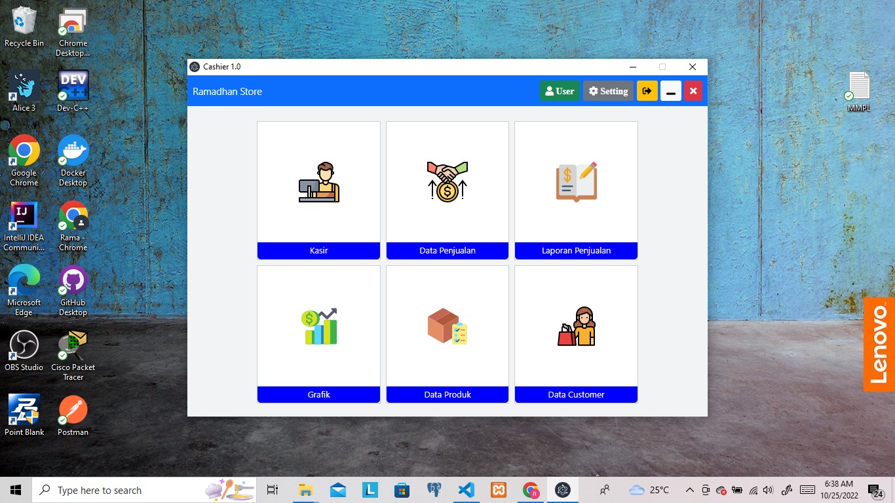
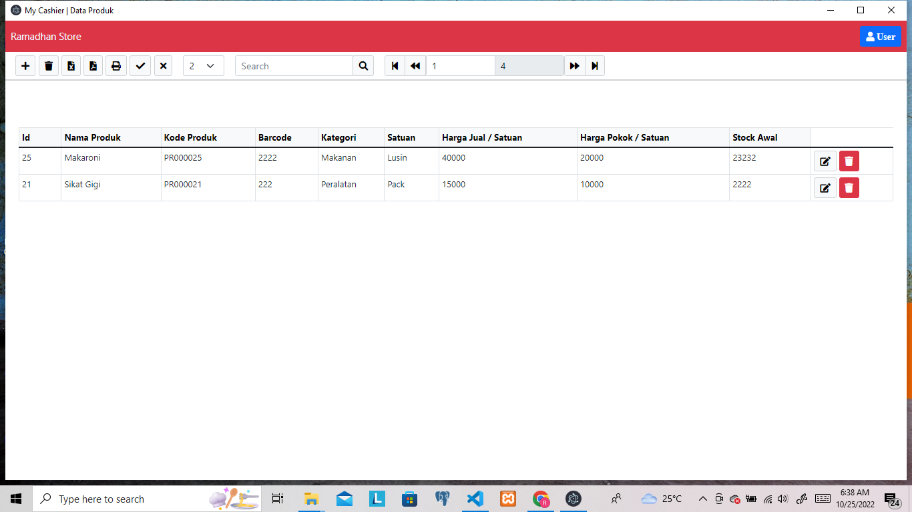
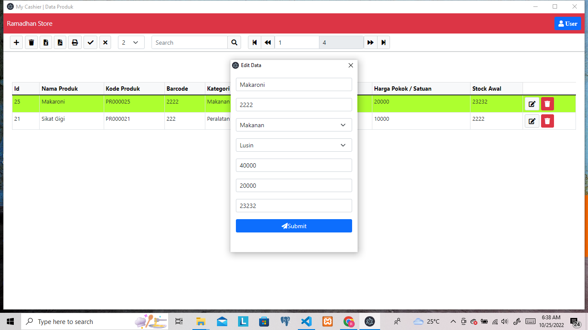
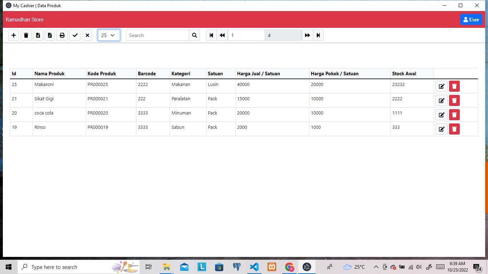

# Aplikasi Cashier Sederhana

#Tujuan

- Untuk Memenuhi Tugas Akhir Semester
- Terinspirasi karena untuk nmembantu emmudahkan tetangga yang mempunyai warung agar lebih mudah

# Teknologi

- Node Js
- Javascript
- Boostrap
- Jquery
- Sqlite3

# Link Vidio Pembelajaran  

https://drive.google.com/drive/folders/1A4_Ip-20q-_mrxucMCXoRycPGl819gnE?usp=sharing